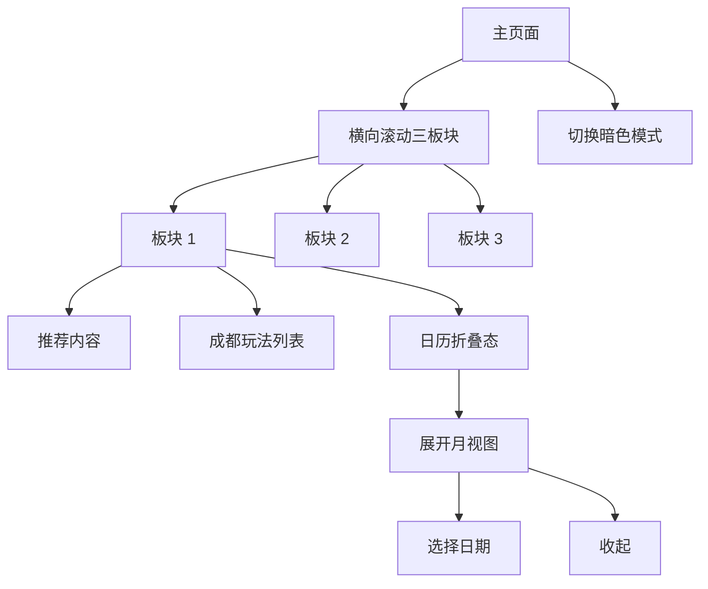

## 1. Product Overview
在现有页面基础上按 Figma 稿改造结构：顶部 Mark + Title 保持不变。
页面下方改为“横向滚动三板块”，其中首板块包含推荐、成都玩法列表与可展开的月视图日历，并同时提供暗色模式方案。

## 2. Core Features

### 2.1 Feature Module
本次改造需求包含以下核心页面：
1. **主页面**：顶部固定 Mark+Title；下方横向滚动三板块；首板块含推荐、成都玩法列表、可展开月视图日历；支持暗色模式。

### 2.3 Page Details
| Page Name | Module Name | Feature description |
|-----------|-------------|---------------------|
| 主页面 | 顶部区（不变） | 展示 Mark 与 Title；保持现有排版与交互不变。 |
| 主页面 | 横向滚动容器 | 横向滚动展示 3 个板块；提供指示/分段反馈（如分页点或当前板块提示，具体样式按 Figma）。 |
| 主页面 | 板块 1：推荐 | 展示推荐内容入口/卡片；支持点击进入对应内容（若 Figma 为纯展示，则仅做可点击态与反馈）。 |
| 主页面 | 板块 1：成都玩法列表 | 以列表形式展示“成都玩法”；支持基础滚动浏览；支持点击列表项（若无详情页，则以弹层/抽屉展示更多信息）。 |
| 主页面 | 板块 1：月视图日历（可展开） | 默认折叠展示（如一行/摘要态）；支持展开为月视图；支持在月视图中选择日期并高亮；支持收起回到折叠态。 |
| 主页面 | 板块 2（按 Figma） | 作为第二个横向板块容器，呈现 Figma 规定的静态内容与基础交互态（点击/hover/按压反馈）。 |
| 主页面 | 板块 3（按 Figma） | 作为第三个横向板块容器，呈现 Figma 规定的静态内容与基础交互态（点击/hover/按压反馈）。 |
| 主页面 | 暗色模式 | 根据系统或站内开关切换明/暗主题；保证文字对比度、卡片层级与分割线在暗色下可用。 |

## 3. Core Process
**用户浏览流程（单一角色）**
1. 进入主页面，首先看到顶部 Mark + Title（保持不变）。
2. 向下浏览到横向滚动区域，左右滑动/滚动查看 3 个板块。
3. 在板块 1：
   - 查看推荐内容；如可点击则进入内容或打开弹层。
   - 浏览“成都玩法列表”，点击某条玩法查看更多（弹层/抽屉或同页区域）。
   - 查看日历折叠态，点击“展开”进入月视图；选择日期；需要时点击“收起”返回。
4. 根据系统主题或开关切换暗色模式，页面样式自动适配。

