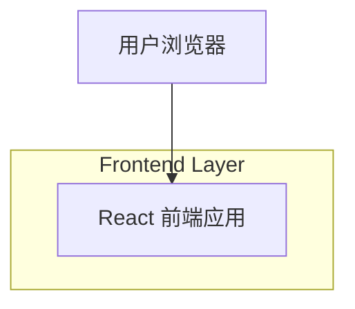

## 1.Architecture design

## 2.Technology Description
- Frontend: React@18 + TypeScript + vite
- Styling: tailwindcss@3（使用 `dark` 变体实现暗色模式）
- Backend: None

## 3.Route definitions
| Route | Purpose |
|-------|---------|
| / | 主页面：顶部 Mark+Title（不变）；下方横向滚动三板块；首板块含推荐、成都玩法列表与可展开月视图日历；支持暗色模式 |

## 6.Data model(if applicable)
本需求未明确数据来源与持久化要求，默认不引入数据库与后端；推荐/玩法/日历展示内容按前端静态配置或后续接入接口再扩展。